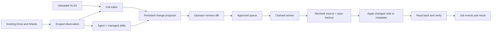

# Folder operations AX

The existing Drive folder and spreadsheets remain the system of record. The console stores configuration, uploaded working copies, mapping profiles, observations, proposals, approvals and execution history in Firebase. Actual OAuth and deployment are deferred at the user's request.

## Responsibilities

| Component | Implemented responsibility |
|---|---|
| DriveWorkspace | Recheck file ancestry under a configured root; reject outside files, root mutations and shortcuts that lead elsewhere |
| Google Drive adapter | Shared Drive compatible paginated listing, metadata, download, copy, upload, rename, trash and restore |
| Report editor | Discover actual sheets; configure up to 50 named cells; read before values; review a diff; save or propose |
| XLSX writer | Patch only changed cell XML; preserve other ZIP members; reject formulas and merged-child writes; read generated output back |
| Native Sheets writer | Read exact ranges; preserve formulas/merged anchors; RAW updates for changed cells only; verify readback |
| Uploaded workbooks | Real Firebase Storage objects plus Firestore versions; usable without Google OAuth; publish as a new Drive XLSX after approval |
| Indexer | One bounded page per step, atomic checkpoint and index rows; resume pagination; distinguish incomplete/stale observations |
| Jobs | Durable pending/queued/running/done/failed/uncertain/rejected states, idempotent proposal keys, transactionally claimed user worker lock |
| Agent | Anthropic tool loop and operator-managed skills; seven workspace tools plus mentoring/mail/calendar/proposal tools; key and model required |
| Hermes/Claude MCP | 13 scoped tools; can inspect sources and propose changes; cannot approve or execute proposals |

## Execution

A client disconnect does not erase the stored job. The worker endpoint can be called by the UI or by a separate scheduled dispatcher. A crash or ambiguous provider response after the write marker produces `uncertain`; it is never automatically replayed. Failures before the marker are `failed`. The operator inspects current source state and submits a fresh proposal if needed. There is no claim of exactly-once transactions across Firestore and Google APIs. Version/before checks reduce conflicts, but an external editor can still race a Sheets write between the final check and update.

Changes to file names, permissions, source cell coordinates or policy cannot be trusted merely because an LLM suggested them. Tools validate scope, types, before values and versions. Every external file mutation requires a human approval. Sharing permissions and permanent deletion are deliberately not exposed by these tools. A folder trash action also affects descendants; the review screen states this.

## Coverage and boundaries

- Any file format can be listed, copied/renamed/trashed/restored within the allowed folder as provider capabilities permit. Folder creation and XLSX publication are supported. Folder copying is not.
- In-app content editing supports XLSX and native Google Sheets. Docs, Slides, PDFs and other binaries open in the original application; body extraction/editing is not implemented for these formats.
- Native Sheets are not converted to XLSX for editing. Uploaded XLSX stays XLSX. A local upload is clearly labeled as an upload copy, not live Drive state.
- Mapping defaults come from the user-provided mentoring report template. They are editable and never silently declared valid for every report. Existing mentoring sheet imports still use the supplied workbook layouts; unrelated spreadsheets need an explicit parser/mapping.
- The index is file-name metadata search, not semantic body search. The UI exposes incomplete scans and pagination. Entries from an old root/generation are excluded from results.
- Settlement eligibility, allowable fees and payment execution are not inferred from folder names. Settlement-specific rules and evidence workflows remain a subsequent feature; no money-moving code is present.
- Google API behavior and a live LLM run remain unverified until credentials/consent are resumed. Dependency-injected Drive tests are explicitly synthetic, while uploaded XLSX and Firebase emulator tests execute real application paths.

## References and design decisions

[Apache Kafka design](https://kafka.apache.org/41/design/design/) explains the limits of delivery guarantees across external systems. This implementation adopts explicit processing state, duplicate suppression and ambiguous-result handling using Firestore, not a Kafka cluster.

[Cloud Run job retries](https://docs.cloud.google.com/run/docs/jobs-retries) informed the durable checkpoints and the choice to disable automatic retries for mutation dispatch jobs. [Drive files.list](https://developers.google.com/workspace/drive/api/reference/rest/v3/files/list) and [Sheets values.batchUpdate](https://developers.google.com/workspace/sheets/api/reference/rest/v4/spreadsheets.values/batchUpdate) are the API references for pagination/shared-drive handling and RAW cell writes.

[Toss Design System article](https://toss.tech/article/toss-design-system) informed consistent controls, long-name wrapping, responsive sizing and focus visibility. AXPM uses its own CSS components with white cards, blue actions and a clear type hierarchy; it does not claim to use or reproduce proprietary Toss components.
